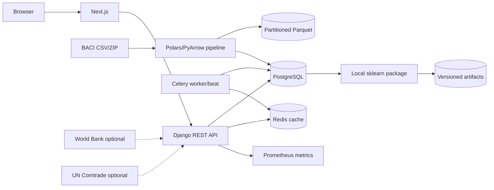

# Architecture

The backend is a modular monolith. Domain logic lives in Django services or the
standalone pipeline/ML packages, never in presentation views. PostgreSQL is the
system of record; Redis handles caching and Celery transport. Parquet is the
immutable analytical interchange format. MinIO is provisioned for object storage.

Dataset processing and activation are separate transactions. A ready dataset is
validated before activation; activation locks competing versions and retains the
previous version for rollback. Model activation follows the same candidate/active/
archived lifecycle with a database uniqueness constraint.

Analytical cache keys include dataset version, endpoint, normalized filters, and
aggregation level. This prevents stale results after activation. Query boundaries
and service interfaces allow ClickHouse to replace large PostgreSQL aggregations
post-MVP without changing public APIs.
